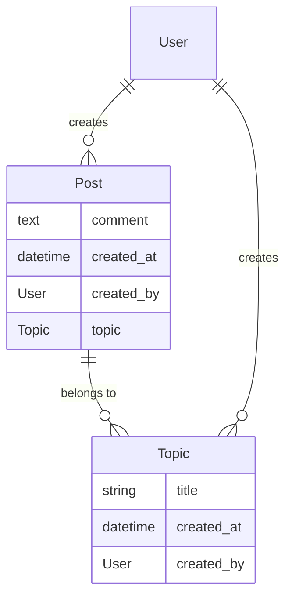

# Session 2

## Answering the tests from the last session

### Set up models


### Set up database migrations

## Authentication and Admin

Add the following test to your pre-existing topic tests:

```python
    def is_registered_in_the_django_admin():
        from django.contrib.admin.sites import site as admin_site
        assert admin_site.is_registered(Topic)
```

this will be inside the `describe_topic` definition.

## TDD

Let's expand the system so we can make posts on a topic!



