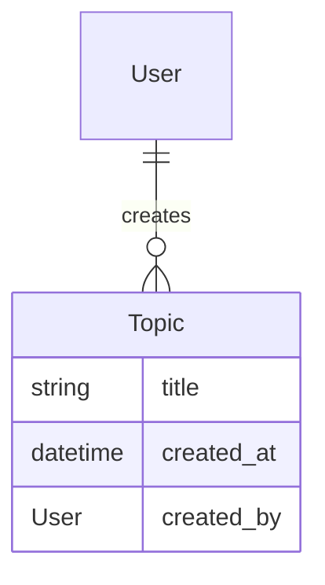
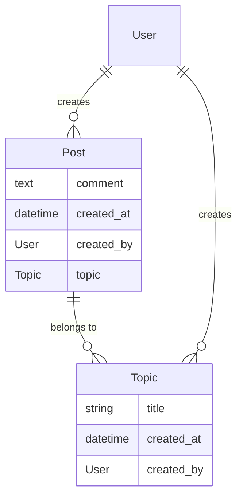
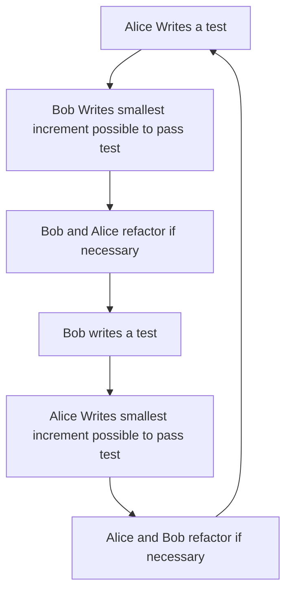

# Session 2

## Answering the tests from the last session

In the last session, we created set up a project and created a few failing tests. In this session, we're first going to answer those tests and set up a few pieces of functionality.

### Set up models

If you recall in the last session, our model looked like the following:


The tests that we have set up expect you to create a `Topic` model.  A model is a representation of a business object as a class, which in the case of most MVC frameworks is mapped to a database table using [an ORM](https://en.wikipedia.org/wiki/Object-relational_mapping).  

Update two files to match the linked files : [test_topic.py](https://gist.githubusercontent.com/markng/19f2d7861a0df0a2b4849037fe0c0e07/raw/8ab62a4f41df7ca5b3a80b15878bef23dbf449a3/test_topic.py) and [requirements.txt](https://gist.githubusercontent.com/markng/1c7cdfed4972169251d6ff54e27a926a/raw/ba57995164e8575c30495595991dff6ff0dd7dbe/requirements.txt). This is to fix an oversight where we forgot to set a test to check for `created_at`. You may need to rebuild your dependencies using `docker-compose build`.

Take a look at the [django models documentation](https://docs.djangoproject.com/en/4.0/topics/db/models/) and [django migrations documentation](https://docs.djangoproject.com/en/4.0/topics/migrations/).

Try to respond to the test failures using what you've read about in the documents above. Ask lots of questions!

### Solution

You should end up with [a models file that looks a bit like this](https://gist.github.com/markng/4f84565329e3e60a843395da5c373cca) and a few migrations files that pass your tests.


## Authentication and Admin

Add the following test to your pre-existing topic tests:

```python
    def is_registered_in_the_django_admin():
        from django.contrib.admin.sites import site as admin_site
        assert admin_site.is_registered(Topic)
```

this will be inside the `describe_topic` definition. How do you think we could make this test pass?

### Solution

You should end up with a [file that look like this](https://gist.github.com/markng/5329205c78125ca64c67b1c4d11837a5). This will now mean that you have activated Django's admin interface for this model.

### Add a super user

Now that you have an admin interface, you'll need an administrative user.

```console
cohort_template % docker-compose run web bash
root@4731f4adc56f:/code# cd cohort/
root@4731f4adc56f:/code/cohort# python manage.py createsuperuser
Username (leave blank to use 'root'): admin
Email address: mark.ng@strongmind.com
Password: 
Password (again): 
Superuser created successfully.

```

### Use the admin interface

You may need to run `python manage.py migrate` in your web bash shell before this.

Now that you have your admin interface configured, if your web server is running you should be able to [browse to your local administration interface](http://localhost:8000/admin/). Log in and take a look at how much functionality you get by using reusable apps. The admin app is included with django, along with some other applications, and there are lots of other applications that you can trivially install that do things like [revision control for your database records](https://django-reversion.readthedocs.io/en/stable/), [add significant debugging capabilities](https://django-debug-toolbar.readthedocs.io/en/latest/), [automatically create documented REST APIs](https://www.django-rest-framework.org/), [provide full featured registration for your application](https://django-registration.readthedocs.io/en/3.2/), [provide full featured full text search for your content](https://django-haystack.readthedocs.io/en/master/), [make your application an LTI tool provider](https://github.com/ccnmtl/django-lti-provider) and many more things.

## TDD

Let's expand the system so we can there are posts on a topic! You'll do this work in pairs, so open up [pop](https://pop.com) and find a pair.




### Decomposition

In the diagram above, we describe the links between a `Post`, a `Topic` and a `User`. Normally, at the start of every pairing session, you would make sure to decompose your story or task into small chunks and design the system so that you have a plan. For this model, we're going to do this for you, and you can concentrate on the TDD workflow. 

### Ping Pong Pairing

We're going to a pairing and TDD workflow often called [Ping Pong Programming](https://openpracticelibrary.com/practice/ping-pong-programming/#:~:text=What%20Is%20Ping%2DPong%20Programming,of%20Pair%20Programming%20and%20TDD.). This look a bit like this.



The TDD cycle is often talked about as

* Red (write a test, which in most test suites turns "Red" to reflect failure)
* Green (respond to a test, which in most test suites turns "Green" to reflect success)
* Refactor (improve current implementation to ensure the implementation can be understood, whilst adding no functionality)

If you look at your current `test_topic.py` file and `models.py` file, you'll see some steps emerging.

* Ensure a model exists at all
* Add fields to the model
* Register the model in admin

Let's try using a TDD flow to create a `Post` model. Ask lots of questions along the way!
