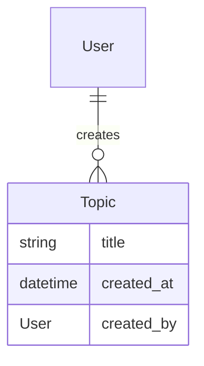
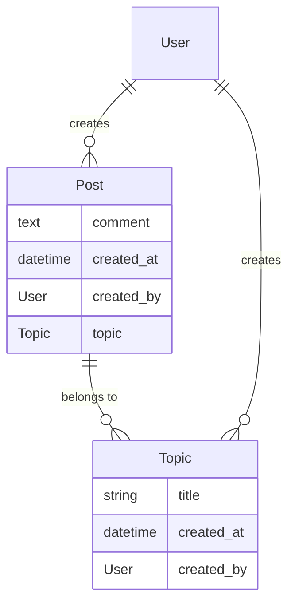

# Session 2

## Answering the tests from the last session

In the last session, we created set up a project and created a few failing tests. In this session, we're first going to answer those tests and set up a few pieces of functionality.

### Set up models

If you recall in the last session, our model looked like the following:


The tests that we have set up expect you to create a `Topic` model.  A model is a representation of a business object as a class, which in the case of most MVC frameworks is mapped to a database table using [an ORM](https://en.wikipedia.org/wiki/Object-relational_mapping).  

Take a look at the [django models documentation](https://docs.djangoproject.com/en/4.0/topics/db/models/) and [django migrations documentation](https://docs.djangoproject.com/en/4.0/topics/migrations/).

Try to respond to the test failures using what you've read about in the documents above.  

<details>
    <summary>Show answer</summary>
</details>


## Authentication and Admin

Add the following test to your pre-existing topic tests:

```python
    def is_registered_in_the_django_admin():
        from django.contrib.admin.sites import site as admin_site
        assert admin_site.is_registered(Topic)
```

this will be inside the `describe_topic` definition.

### Add a super user

### Use the admin interface

## TDD

Let's expand the system so we can make posts on a topic!



